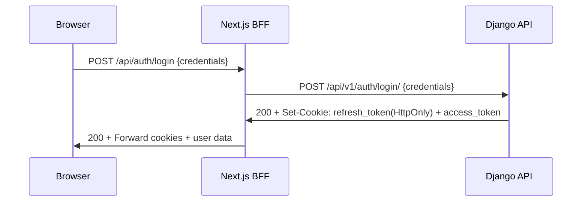
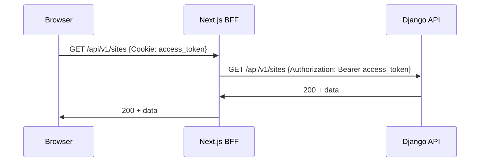
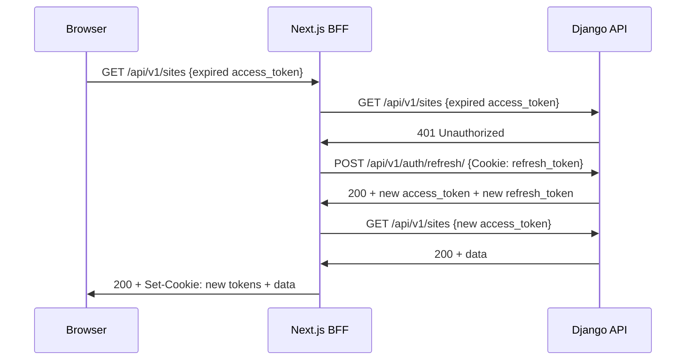

# Autenticazione in Architettura React/Next.js BFF + Django

## 📋 Indice
1. [Panoramica Architetturale](#panoramica-architetturale)
2. [Best Practices per Questa Architettura](#best-practices-per-questa-architettura)
3. [Implementazione Raccomandata](#implementazione-raccomandata)
4. [Analisi della Tua Implementazione Attuale](#analisi-della-tua-implementazione-attuale)
5. [Raccomandazioni Specifiche](#raccomandazioni-specifiche)
6. [Riassunto Flusso Token e Permessi](#riassunto-flusso-token-e-permessi)

---

## 🏗️ Panoramica Architetturale

### Stack Analizzato
```
[Browser] ←→ [Next.js BFF] ←→ [Django API]
```

Questa architettura è **molto comune** e rappresenta una delle migliori pratiche per applicazioni enterprise perché:

✅ **Separazione delle responsabilità**
- Frontend: UI/UX, routing client-side, state management
- BFF: Orchestrazione API, sicurezza, aggregazione dati
- Backend: Business logic, database, autenticazione

✅ **Sicurezza migliorata**
- Token sensibili gestiti server-side
- Protezione CSRF naturale
- Possibilità di nascondere endpoint interni

✅ **Performance**
- Server-side rendering (SSR)
- Caching strategico
- Bundle splitting

---

## 🔐 Best Practices per Questa Architettura

### 1. **Token Strategy: Hybrid Approach**

**RACCOMANDAZIONE INDUSTRY-STANDARD:**

```typescript
// ✅ PATTERN CONSIGLIATO
{
  access_token: "JWT breve (5-15min)",
  storage: "Cookie HttpOnly=false", // Leggibile da JS per middleware
  scope: "API calls"
}

{
  refresh_token: "JWT lungo (7-30 giorni)",
  storage: "Cookie HttpOnly=true", // Solo server-side
  scope: "Token refresh only"
}
```

### 2. **Authentication Flow Ottimale**

#### Login Flow


#### API Request Flow


#### Token Refresh Flow


### 3. **Sicurezza Multi-Layer**

#### Layer 1: Network Security
```typescript
// CORS configuration
CORS_ALLOWED_ORIGINS = [
    'https://yourdomain.com',  // Solo domini autorizzati
]
CORS_ALLOW_CREDENTIALS = True

// Cookie Security
{
  secure: true,      // Solo HTTPS in produzione
  sameSite: 'strict', // Protezione CSRF
  domain: '.yourdomain.com', // Subdomain sharing se necessario
}
```

#### Layer 2: Token Security
```python
# JWT Configuration
SIMPLE_JWT = {
    "ACCESS_TOKEN_LIFETIME": timedelta(minutes=15),
    "REFRESH_TOKEN_LIFETIME": timedelta(days=7),
    "ROTATE_REFRESH_TOKENS": True,        # ✅ ESSENZIALE
    "BLACKLIST_AFTER_ROTATION": True,     # ✅ SICUREZZA
    "ALGORITHM": "RS256",                 # ✅ Asimmetrico
    "SIGNING_KEY": private_key,
    "VERIFYING_KEY": public_key,
}
```

#### Layer 3: Request Validation
```typescript
// BFF Request Validation
export async function POST(request: NextRequest) {
    // 1. Rate limiting
    // 2. Request size limits
    // 3. Input validation
    // 4. CSRF protection
}
```

---

## 🛠️ Implementazione Raccomandata

### **Architettura Consigliata per il Tuo Caso**

#### 1. **Django Backend (API Only)**
```python
# settings.py - Configurazione JWT ottimale
SIMPLE_JWT = {
    "ACCESS_TOKEN_LIFETIME": timedelta(minutes=15),
    "REFRESH_TOKEN_LIFETIME": timedelta(days=7),
    "ROTATE_REFRESH_TOKENS": True,
    "BLACKLIST_AFTER_ROTATION": True,
    "UPDATE_LAST_LOGIN": True,
    "ALGORITHM": "HS256",  # Simmetrico per semplicità
    "SIGNING_KEY": settings.SECRET_KEY,
    "AUTH_HEADER_TYPES": ("Bearer",),
    "AUTH_TOKEN_CLASSES": ("rest_framework_simplejwt.tokens.AccessToken",),
}

# dj-rest-auth configuration
REST_AUTH = {
    'USE_JWT': True,
    'JWT_AUTH_COOKIE': 'access_token',
    'JWT_AUTH_REFRESH_COOKIE': 'refresh_token',
    'JWT_AUTH_HTTPONLY': False,  # Access token readable by JS
    'JWT_AUTH_REFRESH_COOKIE_HTTP_ONLY': True,  # Refresh token HTTP-only
    'JWT_AUTH_SECURE': True,  # HTTPS only in production
    'JWT_AUTH_SAMESITE': 'Strict',
}
```

#### 2. **Next.js BFF (Smart Proxy)**
```typescript
// middleware.ts - Auto-refresh transparente
export async function middleware(request: NextRequest) {
    if (request.nextUrl.pathname.startsWith('/api/v1/')) {
        const accessToken = request.cookies.get('access_token')?.value;

        if (!accessToken || isTokenExpired(accessToken)) {
            // Auto-refresh before forwarding request
            await refreshTokens(request);
        }
    }
}

// lib/auth-utils.ts - Utility per gestione token
export async function refreshTokens(request: NextRequest) {
    const refreshToken = request.cookies.get('refresh_token')?.value;

    if (!refreshToken) {
        throw new Error('No refresh token available');
    }

    const response = await fetch(`${process.env.DJANGO_URL}/api/v1/auth/refresh/`, {
        method: 'POST',
        headers: { 'Cookie': `refresh_token=${refreshToken}` }
    });

    if (!response.ok) {
        throw new Error('Token refresh failed');
    }

    // Update cookies with new tokens
    const setCookies = response.headers.getSetCookie();
    return setCookies;
}
```

#### 3. **React Frontend (Stateless)**
```typescript
// context/AuthContext.tsx - Context minimale
export const AuthProvider = ({ children }) => {
    const [user, setUser] = useState(null);
    const [loading, setLoading] = useState(true);

    // No token management - tutto gestito dal BFF
    const login = async (credentials) => {
        const response = await fetch('/api/auth/login', {
            method: 'POST',
            body: JSON.stringify(credentials),
            credentials: 'include' // Include cookies automatically
        });

        if (response.ok) {
            const userData = await response.json();
            setUser(userData.user);
        }
    };

    return (
        <AuthContext.Provider value={{ user, login, logout, loading }}>
            {children}
        </AuthContext.Provider>
    );
};
```

---

## 📊 Analisi della Tua Implementazione Attuale

### ✅ **Punti di Forza**
1. **Architettura corretta**: BFF pattern ben implementato
2. **Sicurezza cookies**: Refresh token HttpOnly ✅
3. **CORS configurato**: Allow credentials abilitato ✅
4. **Axios interceptor**: Gestione automatica refresh ✅

### ⚠️ **Aree di Miglioramento**
1. **Rotazione token**: Configurazione incoerente
2. **Error handling**: Alcuni edge case non gestiti
3. **Security headers**: Mancano alcuni header di sicurezza
4. **Token validation**: No validazione JWT lato frontend

### 🔴 **Problemi Critici Identificati**

#### Problema 1: Token Rotation Mismatch
```python
# Backend settings.py:165
"ROTATE_REFRESH_TOKENS": False,  # ❌
```
```typescript
// Frontend refresh route aspetta rotazione
const newRefreshTokenCookie = backendResponse.headers['set-cookie']?.[0]; // ❌
```

#### Problema 2: Axios Interceptor Bug
```typescript
// lib/axios.ts:19
prom.resolve(api(error!.config!)); // ❌ Dovrebbe essere originalRequest
```

---

## 🎯 Raccomandazioni Specifiche

### **Immediate Actions (Priority 1)**

1. **Fix Token Rotation**
```python
# backend/config/settings.py
"ROTATE_REFRESH_TOKENS": True,
"BLACKLIST_AFTER_ROTATION": True,
```

2. **Fix Axios Interceptor**
```typescript
// frontend/src/lib/axios.ts
prom.resolve(api(originalRequest));
```

3. **Add Security Headers**
```python
# settings.py
SECURE_SSL_REDIRECT = True  # Produzione
SECURE_BROWSER_XSS_FILTER = True
SECURE_CONTENT_TYPE_NOSNIFF = True
```

### **Medium Priority Actions**

1. **Add Request Validation**
2. **Implement Rate Limiting**
3. **Add Comprehensive Logging**
4. **Token Blacklist Cleanup Job**

### **Future Enhancements**

1. **JWT Verification in BFF**
2. **Redis Session Store**
3. **Multi-factor Authentication**
4. **API Gateway Integration**

---

## 📝 Riassunto Flusso Token e Permessi

### **🔄 Ciclo di Vita Token**

#### **Fase 1: Login Iniziale**
```
1. User inserisce credenziali
2. Frontend → BFF → Django
3. Django valida credenziali
4. Django genera access_token (15min) + refresh_token (7 giorni)
5. Django imposta cookies: access_token (readable) + refresh_token (httpOnly)
6. Cookies forwarded al browser automaticamente
```

#### **Fase 2: Richieste API Normali**
```
1. Frontend fa richiesta API
2. Browser include automaticamente cookies
3. BFF estrae access_token dai cookies
4. BFF aggiunge header: Authorization: Bearer {access_token}
5. Django valida token JWT
6. Se valido → risposta dati
7. Se scaduto → 401 Unauthorized
```

#### **Fase 3: Token Refresh Automatico**
```
1. Axios interceptor rileva 401
2. Interceptor chiama /api/auth/token/refresh
3. BFF estrae refresh_token dai cookies
4. BFF → Django refresh endpoint
5. Django valida refresh_token
6. Django genera nuovo access_token + refresh_token
7. Nuovi cookies impostati automaticamente
8. Richiesta originale ripetuta con nuovo token
```

#### **Fase 4: Logout/Scadenza**
```
1. Logout manuale O refresh_token scaduto
2. Tutti i token vengono invalidati
3. Cookie cancellati
4. Redirect a /login
```

### **🛡️ Livelli di Sicurezza**

#### **Livello 1: Network**
- HTTPS obbligatorio in produzione
- CORS restrittivo per domini autorizzati
- SameSite cookies per protezione CSRF

#### **Livello 2: Token**
- JWT firmati con chiave segreta
- Access token brevi (15 minuti)
- Refresh token rotativi e blacklist
- HttpOnly per token sensibili

#### **Livello 3: Application**
- Validazione input su tutti gli endpoint
- Rate limiting per prevenire brute force
- Permission-based access control
- Audit logging per accessi critici

### **🔑 Gestione Permessi**

#### **Model-Level Permissions**
```python
# Django - User Site Access
class UserSiteAccess(models.Model):
    user = models.ForeignKey(User, on_delete=models.CASCADE)
    site = models.ForeignKey(Site, on_delete=models.CASCADE)
    granted_at = models.DateTimeField(auto_now_add=True)
```

#### **View-Level Filtering**
```python
# Django ViewSet
def get_queryset(self):
    if self.request.user.is_superuser:
        return Site.objects.all()
    return Site.objects.filter(user_accesses__user=self.request.user)
```

#### **Frontend Permission Checks**
```typescript
// React Component
const canAccessSite = (siteId) => {
    return user?.accessible_sites?.includes(siteId) || user?.is_superuser;
};
```

---

## 🏆 Conclusioni

La tua architettura è **solida e segue le best practices** per questo tipo di stack. I problemi identificati sono principalmente di configurazione e facilmente risolvibili.

### **Punti di Forza Principali:**
1. ✅ Separazione corretta delle responsabilità
2. ✅ Sicurezza cookies implementata correttamente
3. ✅ Auto-refresh trasparente funzionante
4. ✅ Permission system granulare

### **Next Steps Raccomandati:**
1. 🔧 Fix immediate dei problemi critici identificati
2. 🛡️ Aggiunta security headers per produzione
3. 📊 Implementazione logging e monitoring
4. 🚀 Ottimizzazioni performance (caching, rate limiting)

Questa implementazione ti garantisce:
- **Sicurezza**: Token rotativi, HttpOnly cookies, CORS
- **UX**: Refresh automatico, no interruzioni
- **Scalabilità**: BFF può gestire cache e aggregazione
- **Manutenibilità**: Separazione chiara frontend/backend