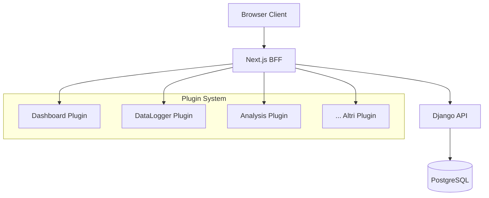
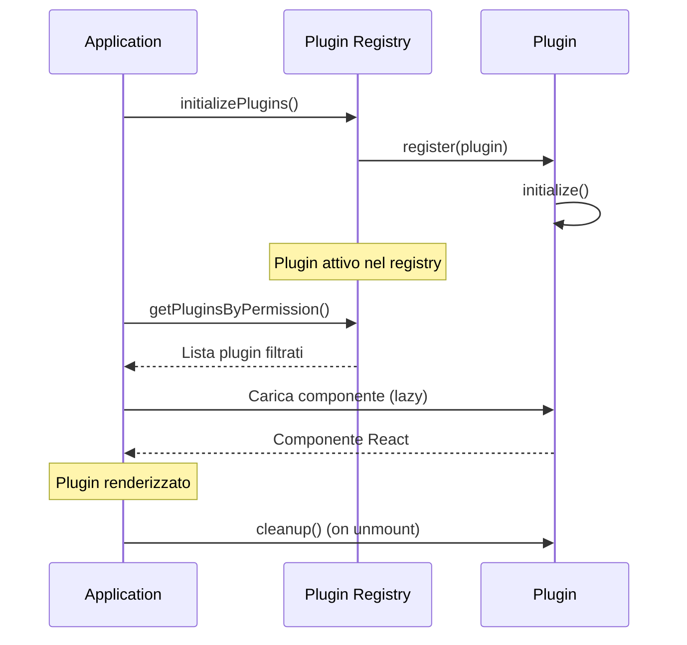

# 🏗️ Architettura del Sistema

Documentazione completa dell'architettura del progetto BFG, incluso il sistema plugin modulare.

## 📋 Indice

- [Panoramica Generale](#panoramica-generale)
- [Architettura Backend](#architettura-backend)
- [Architettura Frontend](#architettura-frontend)
- [Sistema Plugin](#sistema-plugin)
- [Sicurezza e Autenticazione](#sicurezza-e-autenticazione)
- [Database e Persistenza](#database-e-persistenza)
- [Containerizzazione](#containerizzazione)
- [Pattern e Best Practices](#pattern-e-best-practices)

## 🌟 Panoramica Generale

BFG utilizza un'architettura **Backend for Frontend (BFF)** con sistema plugin modulare per massima flessibilità e scalabilità.



### Caratteristiche Principali

- **Modulare**: Sistema plugin sganciabile
- **Scalabile**: Architettura microservizi-ready
- **Sicuro**: Autenticazione JWT asimmetrica
- **Containerizzato**: Docker per tutti i componenti
- **Type-Safe**: TypeScript end-to-end

## 🔧 Architettura Backend

### Stack Tecnologico

- **Framework**: Django 4.x + Django REST Framework
- **Database**: PostgreSQL 15+
- **Autenticazione**: JWT con chiavi asimmetriche
- **Containerizzazione**: Docker + Docker Compose

### Struttura Directories

```
backend/
├── config/                     # Configurazione Django
│   ├── settings/
│   │   ├── base.py            # Settings base
│   │   ├── development.py     # Settings sviluppo
│   │   └── production.py      # Settings produzione
│   ├── urls.py                # URL root
│   └── wsgi.py               # WSGI config
├── apps/                      # Applicazioni Django
│   ├── authentication/       # Gestione utenti e auth
│   ├── core/                 # Funzionalità core
│   └── api/                  # API endpoints
├── keys/                     # Chiavi JWT
│   ├── private.pem          # Chiave privata (signing)
│   └── public.pem           # Chiave pubblica (verification)
├── requirements.txt          # Dipendenze Python
└── manage.py
```

### API Endpoints

```python
# Authentication
POST /api/auth/login/              # Login utente
POST /api/auth/logout/             # Logout utente
POST /api/auth/password-reset/     # Reset password
GET  /api/auth/user/               # Info utente corrente
GET  /api/auth/public-key/         # Chiave pubblica JWT

# Core API
GET  /api/core/health/             # Health check
GET  /api/core/version/            # Versione API
```

### Modelli Dati

```python
# apps/authentication/models.py
class User(AbstractUser):
    email = models.EmailField(unique=True)
    is_staff = models.BooleanField(default=False)
    is_superuser = models.BooleanField(default=False)
    created_at = models.DateTimeField(auto_now_add=True)
    updated_at = models.DateTimeField(auto_now=True)
```

### Middleware e Security

```python
# Middleware attivi
MIDDLEWARE = [
    'corsheaders.middleware.CorsMiddleware',
    'django.middleware.security.SecurityMiddleware',
    'django.contrib.sessions.middleware.SessionMiddleware',
    'django.middleware.common.CommonMiddleware',
    'django.middleware.csrf.CsrfViewMiddleware',
    'django.contrib.auth.middleware.AuthenticationMiddleware',
    'rest_framework_simplejwt.middleware.JWTAuthenticationMiddleware',
]

# Security settings
SECURE_BROWSER_XSS_FILTER = True
SECURE_CONTENT_TYPE_NOSNIFF = True
X_FRAME_OPTIONS = 'DENY'
```

## ⚛️ Architettura Frontend

### Stack Tecnologico

- **Framework**: Next.js 15 (App Router)
- **UI**: React 19 + TypeScript
- **Styling**: Tailwind CSS + Radix UI
- **State Management**: Zustand + React Query
- **Build**: Turbo + ESLint

### Struttura Directories

```
frontend/src/
├── app/                       # Next.js App Router
│   ├── (auth)/               # Route autenticazione
│   ├── (private)/            # Route protette
│   │   ├── (guest)/         # Accessibili a tutti gli utenti
│   │   ├── (staff)/         # Solo staff
│   │   └── (superuser)/     # Solo superuser
│   ├── api/                 # API Routes (BFF)
│   ├── layout.tsx           # Layout root
│   └── providers.tsx        # Provider globali
├── components/              # Componenti UI
│   ├── ui/                 # Componenti base (Radix/Shadcn)
│   ├── app-sidebar.tsx     # Sidebar principale
│   ├── nav-main.tsx        # Navigazione principale
│   └── PluginRouteRenderer.tsx  # Renderer plugin
├── plugins/                # Sistema Plugin
│   ├── types.ts           # Type definitions
│   ├── registry.ts        # Registry centrale
│   ├── index.ts          # Inizializzazione
│   ├── dashboard/        # Plugin Dashboard
│   └── datalogger/       # Plugin DataLogger
├── hooks/                 # Custom hooks
├── lib/                   # Utilities e config
├── store/                 # Zustand stores
├── types/                 # TypeScript types
└── middleware.ts          # Next.js middleware
```

### App Router Structure

```typescript
// Route organization
app/
├── (auth)/
│   ├── login/page.tsx                    # /login
│   └── reset-password/page.tsx           # /reset-password
├── (private)/
│   ├── layout.tsx                        # Layout per route protette
│   ├── (guest)/
│   │   ├── dashboard/page.tsx            # /dashboard
│   │   ├── settings/page.tsx             # /settings
│   │   └── version/page.tsx              # /version
│   ├── (staff)/
│   │   ├── datalogger/page.tsx           # /datalogger
│   │   └── staff-admin/page.tsx          # /staff-admin
│   └── (superuser)/
│       └── system/page.tsx               # /system
└── api/                                  # BFF API Routes
    ├── auth/*/route.ts                   # Proxy auth backend
    └── theme/route.ts                    # Gestione tema
```

### State Management

```typescript
// Zustand stores
├── store/
│   ├── authStore.ts      # Stato autenticazione
│   ├── tabStore.ts       # Gestione tabs
│   ├── gridStore.ts      # Sistema griglia
│   └── themeStore.ts     # Tema UI

// React Query
├── hooks/
│   ├── useAuth.ts        # Hook autenticazione
│   ├── useApi.ts         # Hook API calls
│   └── usePlugin.ts      # Hook plugin system
```

## 🔌 Sistema Plugin

### Architettura Plugin

Il sistema plugin è progettato per massima modularità e indipendenza.

```typescript
// Plugin Architecture
interface Plugin {
  metadata: {
    id: string           // Identificatore unico
    name: string         // Nome visualizzato
    version: string      // Versione plugin
    description: string  // Descrizione funzionalità
  }
  routes: PluginRoute[]         // Rotte del plugin
  navItems: PluginNavItem[]     // Elementi navigazione
  permissions: PluginPermission // Controllo accessi
  enabled: boolean              // Stato attivazione
}
```

### Plugin Registry

```typescript
// Registry centrale per gestione plugin
class PluginRegistryImpl {
  private plugins = new Map<string, Plugin>()

  register(plugin: Plugin): void
  getEnabledPlugins(): Plugin[]
  getPluginsByPermission(permissions: PluginPermission): Plugin[]
  getAllPluginRoutes(permissions: PluginPermission): PluginRoute[]
  getAllPluginNavItems(permissions: PluginPermission): PluginNavItem[]
}
```

### Plugin Lifecycle



### Integration Flow

1. **Registrazione**: Plugin registrati all'avvio app
2. **Filtraggio**: Registry filtra per permessi utente
3. **Navigazione**: Sidebar aggiornata dinamicamente
4. **Routing**: Route handler carica plugin appropriato
5. **Rendering**: Componente plugin renderizzato lazy

## 🔐 Sicurezza e Autenticazione

### JWT Asimmetrico

```typescript
// Backend: Firma token con chiave privata
const token = jwt.sign(payload, privateKey, { algorithm: 'RS256' })

// Frontend BFF: Verifica con chiave pubblica
const decoded = jwt.verify(token, publicKey, { algorithms: ['RS256'] })
```

### Cookie Security

```typescript
// Configurazione cookie sicuri
const cookieOptions = {
  httpOnly: true,           // access_token accessibile da JS
  secure: true,             // Solo HTTPS in produzione
  sameSite: 'strict',       // Protezione CSRF
  maxAge: 15 * 60 * 1000   // 15 minuti per access_token
}

// refresh_token sempre httpOnly
const refreshCookieOptions = {
  ...cookieOptions,
  httpOnly: true,           // Non accessibile da JS
  maxAge: 7 * 24 * 60 * 60 * 1000  // 7 giorni
}
```

### Middleware Protection

```typescript
// middleware.ts - Protezione route
export function middleware(request: NextRequest) {
  const token = request.cookies.get('access_token')?.value

  if (!token) {
    return NextResponse.redirect(new URL('/login', request.url))
  }

  try {
    const payload = jwt.verify(token, publicKey)
    // Verifica permessi basati su route
    return NextResponse.next()
  } catch (error) {
    return NextResponse.redirect(new URL('/login', request.url))
  }
}
```

### Permission System

```typescript
// Sistema permessi gerarchico
const ROLE_HIERARCHY = {
  'guest': 0,      // Utenti base
  'staff': 1,      // Staff/Admin
  'superuser': 2   // Super admin
}

// Controllo accesso plugin
function hasAccess(userRole: string, requiredRole: string): boolean {
  return ROLE_HIERARCHY[userRole] >= ROLE_HIERARCHY[requiredRole]
}
```

## 💾 Database e Persistenza

### Schema Database

```sql
-- Tabelle principali
CREATE TABLE auth_user (
    id SERIAL PRIMARY KEY,
    username VARCHAR(150) UNIQUE NOT NULL,
    email VARCHAR(254) UNIQUE NOT NULL,
    password VARCHAR(128) NOT NULL,
    is_staff BOOLEAN DEFAULT FALSE,
    is_superuser BOOLEAN DEFAULT FALSE,
    is_active BOOLEAN DEFAULT TRUE,
    date_joined TIMESTAMP DEFAULT NOW(),
    last_login TIMESTAMP
);

-- Plugin configuration (futuro)
CREATE TABLE plugin_config (
    id SERIAL PRIMARY KEY,
    plugin_id VARCHAR(100) NOT NULL,
    user_id INTEGER REFERENCES auth_user(id),
    config_data JSONB,
    enabled BOOLEAN DEFAULT TRUE,
    created_at TIMESTAMP DEFAULT NOW()
);
```

### Persistenza Frontend

```typescript
// Zustand con persistenza
const useTabStore = create<TabState>()(
  persist(
    (set, get) => ({
      tabs: [],
      activeTab: null,
      // ... state methods
    }),
    {
      name: 'tab-storage',
      storage: createJSONStorage(() => localStorage)
    }
  )
)
```

## 🐳 Containerizzazione

### Docker Architecture

```yaml
# docker-compose.yml
services:
  backend:
    build: ./backend
    environment:
      - DATABASE_URL=postgresql://user:pass@db:5432/bfg_db
    depends_on:
      - db
    networks:
      - bfg_network

  frontend:
    build: ./frontend
    environment:
      - INTERNAL_API_URL=http://backend:8000
    depends_on:
      - backend
    ports:
      - "3000:3000"
    networks:
      - bfg_network

  db:
    image: postgres:15
    environment:
      - POSTGRES_DB=bfg_db
      - POSTGRES_USER=bfg_user
      - POSTGRES_PASSWORD=bfg_password
    volumes:
      - postgres_data:/var/lib/postgresql/data
    networks:
      - bfg_network

networks:
  bfg_network:
    driver: bridge

volumes:
  postgres_data:
```

### Multi-stage Builds

```dockerfile
# frontend/Dockerfile
FROM node:18-alpine AS deps
WORKDIR /app
COPY package*.json ./
RUN npm ci --only=production

FROM node:18-alpine AS builder
WORKDIR /app
COPY . .
COPY --from=deps /app/node_modules ./node_modules
RUN npm run build

FROM node:18-alpine AS runner
WORKDIR /app
COPY --from=builder /app/.next ./.next
COPY --from=builder /app/public ./public
COPY --from=deps /app/node_modules ./node_modules
CMD ["npm", "start"]
```

## 🎯 Pattern e Best Practices

### Frontend Patterns

#### Component Composition

```typescript
// Composizione componenti modulari
<Card>
  <CardHeader>
    <CardTitle>Titolo</CardTitle>
  </CardHeader>
  <CardContent>
    <PluginContent pluginId="datalogger" />
  </CardContent>
</Card>
```

#### Custom Hooks

```typescript
// Hook riutilizzabili per logica business
export function usePlugin(pluginId: string) {
  const { data: userData } = useUserInfo()

  return useMemo(() => {
    if (!userData) return null

    const permissions = getUserPermissions(userData)
    return pluginRegistry.getPlugin(pluginId)
  }, [pluginId, userData])
}
```

#### Error Boundaries

```typescript
// Gestione errori plugin isolati
export function PluginErrorBoundary({ children, pluginId }: Props) {
  return (
    <ErrorBoundary
      fallback={<PluginErrorFallback pluginId={pluginId} />}
      onError={(error) => logPluginError(pluginId, error)}
    >
      {children}
    </ErrorBoundary>
  )
}
```

### Backend Patterns

#### API Versioning

```python
# URL patterns con versioning
urlpatterns = [
    path('api/v1/', include('api.v1.urls')),
    path('api/v2/', include('api.v2.urls')),
]
```

#### Serializer Composition

```python
# Serializer modulari e riutilizzabili
class UserSerializer(serializers.ModelSerializer):
    class Meta:
        model = User
        fields = ['id', 'username', 'email', 'is_staff', 'is_superuser']

class UserDetailSerializer(UserSerializer):
    class Meta(UserSerializer.Meta):
        fields = UserSerializer.Meta.fields + ['date_joined', 'last_login']
```

### Plugin Development Patterns

#### Plugin Factory

```typescript
// Factory per creazione plugin standardizzata
export function createPlugin(config: PluginConfig): Plugin {
  return {
    metadata: {
      id: config.id,
      name: config.name,
      version: config.version || '1.0.0',
      description: config.description
    },
    routes: config.routes,
    navItems: config.navItems,
    permissions: config.permissions || { role: 'guest' },
    enabled: config.enabled ?? true,
    initialize: config.initialize,
    cleanup: config.cleanup
  }
}
```

#### Plugin Communication

```typescript
// Event system per comunicazione tra plugin
export const pluginEventBus = new EventTarget()

// Plugin publisher
pluginEventBus.dispatchEvent(new CustomEvent('data-updated', {
  detail: { source: 'datalogger', data: newData }
}))

// Plugin subscriber
pluginEventBus.addEventListener('data-updated', (event) => {
  console.log('Data updated:', event.detail)
})
```

## 📈 Scalabilità e Performance

### Frontend Optimization

- **Code Splitting**: Plugin caricati lazy
- **Bundle Analysis**: Monitoring dimensioni bundle
- **Caching**: React Query per cache intelligente
- **Memoization**: Prevenzione re-render inutili

### Backend Optimization

- **Database Indexing**: Indici su query frequenti
- **Query Optimization**: Select related e prefetch
- **Caching**: Redis per session e cache API
- **Connection Pooling**: pgBouncer per PostgreSQL

### Monitoring

```typescript
// Metriche performance plugin
export function trackPluginPerformance(pluginId: string, operation: string) {
  const start = performance.now()

  return {
    end: () => {
      const duration = performance.now() - start
      analytics.track('plugin_performance', {
        pluginId,
        operation,
        duration
      })
    }
  }
}
```

---

*Per approfondimenti su aspetti specifici dell'architettura, consulta la documentazione specializzata o contatta il team di sviluppo.*