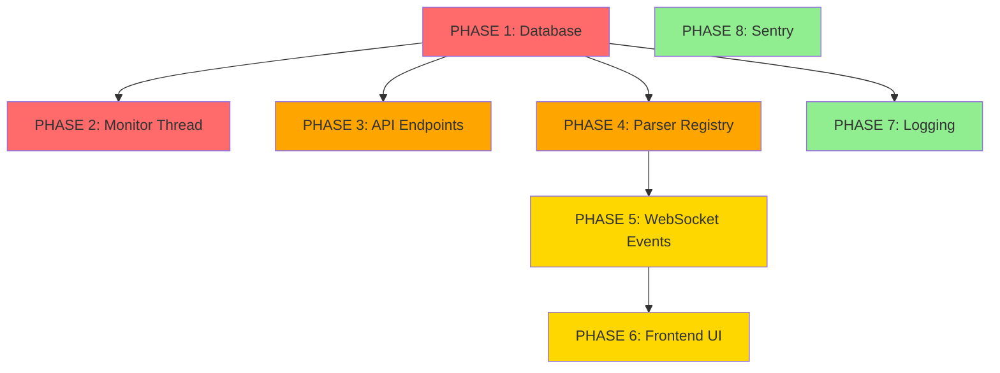

# MQTT Architecture - Implementation Plan

## Scopo
Piano di sviluppo fase per fase con priorità, dipendenze, e testing.

---

## Prioritization Matrix

| Phase | Priority | Complexity | Impact | Dependencies | Est. Time |
|-------|----------|------------|--------|--------------|-----------|
| **PHASE 1** | 🔴 CRITICAL | ⭐ LOW | 🎯 HIGH | None | 30 min |
| **PHASE 2** | 🔴 CRITICAL | ⭐⭐ MEDIUM | 🎯 HIGH | PHASE 1 | 1 hour |
| **PHASE 3** | 🟠 HIGH | ⭐ LOW | 🎯 HIGH | PHASE 1 | 30 min |
| **PHASE 4** | 🟠 HIGH | ⭐⭐⭐ HIGH | 🎯 CRITICAL | PHASE 1 | 3 hours |
| **PHASE 5** | 🟡 MEDIUM | ⭐⭐ MEDIUM | 🎯 MEDIUM | PHASE 4 | 1 hour |
| **PHASE 6** | 🟡 MEDIUM | ⭐ LOW | 🎯 MEDIUM | PHASE 5 | 30 min |
| **PHASE 7** | 🟢 LOW | ⭐⭐ MEDIUM | 🎯 MEDIUM | PHASE 1 | 2 hours |
| **PHASE 8** | 🟢 LOW | ⭐ LOW | 🎯 MEDIUM | None | 15 min |

**Legend**:
- Priority: 🔴 Critical → 🟠 High → 🟡 Medium → 🟢 Low
- Complexity: ⭐ Low (1-2h) → ⭐⭐ Medium (2-4h) → ⭐⭐⭐ High (4-8h)
- Impact: 🎯 How much it affects the system

---

## Phase Overview

### **PHASE 1: Database Refactoring** ⏱️ 30min
**Status**: 🔴 CRITICAL - BLOCKER
**Goal**: Rinominare campi per omogeneità naming
**Deliverables**:
- Migration: `MqttConnection.is_enabled` → `is_active`
- Migration: `DiscoveredTopic.is_processed` → `is_processable`
- New models: `MqttConnectionLog`, `MqttParsingLog`

**Why Critical**: Tutti gli altri componenti dipendono da naming corretto

---

### **PHASE 2: Monitor Thread Refactoring** ⏱️ 1h
**Status**: 🔴 CRITICAL - CORE FUNCTIONALITY
**Goal**: Garantire monitor thread usa `is_active` invece di `is_enabled`
**Deliverables**:
- Update `MQTTService.monitor_connections()` per usare `is_active`
- Update `MQTTConnectionManager` per loggare errori correttamente
- Test auto-start/stop connessioni

**Why Critical**: È il cuore del sistema di auto-healing

---

### **PHASE 3: API Endpoints Refactoring** ⏱️ 30min
**Status**: 🟠 HIGH - MANUAL CONTROL
**Goal**: API solo cambia DB, non chiama service direttamente
**Deliverables**:
- Update `start_connection()` API view
- Update `stop_connection()` API view
- Rimuovere chiamate dirette a `mqtt_service`

**Why High**: Fondamentale per architettura decoupled

---

### **PHASE 4: Parser Registry System** ⏱️ 3h
**Status**: 🟠 HIGH - EXTENSIBILITY
**Goal**: Implementare sistema parser configurabile con Pydantic
**Deliverables**:
- `TopicParser` base class
- `ParserRegistry` singleton
- Pydantic schemas per telemetry/gateway
- Refactor `MqttMessageProcessor` per usare registry
- Check `MqttTopic.is_active` nel pipeline

**Why High**: Rende il sistema estensibile e type-safe

---

### **PHASE 5: WebSocket Events Enhancement** ⏱️ 1h
**Status**: 🟡 MEDIUM - REAL-TIME UX
**Goal**: Broadcast eventi più granulari
**Deliverables**:
- Eventi separati per ogni entity (gateway, datalogger, sensor)
- Frontend già fixato (fatto oggi)

**Why Medium**: Frontend già gestisce eventi, solo miglioramenti

---

### **PHASE 6: Frontend UI Enhancements** ⏱️ 30min
**Status**: 🟡 MEDIUM - UX POLISH
**Goal**: Feedback visivo durante delay 30s
**Deliverables**:
- Loading state con countdown timer
- Toast notifications più chiare

**Why Medium**: Nice-to-have, non blocca funzionalità

---

### **PHASE 7: Logging System** ⏱️ 2h
**Status**: 🟢 LOW - OBSERVABILITY
**Goal**: Logging strutturato DB + file
**Deliverables**:
- Configurazione file logging separati
- Helper functions per DB logging
- Django Admin customization per log models

**Why Low**: Funziona anche senza, ma utile per debug

---

### **PHASE 8: Sentry Integration** ⏱️ 15min
**Status**: 🟢 LOW - MONITORING
**Goal**: Error tracking con Sentry
**Deliverables**:
- Settings Sentry
- Environment variables
- Test error capture

**Why Low**: Facilissimo ma non critico

---

## Execution Order



**Recommended Execution**:
1. PHASE 1 (database) → **Deploy immediately**
2. PHASE 2 (monitor) + PHASE 3 (API) → **Deploy together**
3. PHASE 4 (parsers) → **Test heavily, deploy**
4. PHASE 5 (websocket) + PHASE 6 (frontend) → **Deploy together**
5. PHASE 7 (logging) → **Deploy when convenient**
6. PHASE 8 (sentry) → **Deploy anytime**

---

## Testing Strategy

### **Integration Tests**

```python
# tests/integration/test_mqtt_lifecycle.py

class TestMqttLifecycle:
    """
    Test completo del ciclo di vita connessione MQTT
    """

    def test_auto_start_on_container_boot(self):
        """Container avvia → MQTT service auto-start connessioni active"""
        pass

    def test_monitor_thread_connects_active_sites(self):
        """Monitor thread connette siti con is_active=True"""
        pass

    def test_monitor_thread_disconnects_inactive_sites(self):
        """Monitor thread disconnette siti con is_active=False"""
        pass

    def test_manual_start_via_api(self):
        """
        1. API call set is_active=True
        2. Wait max 30s
        3. Verify connection status=connected
        4. Verify WebSocket broadcast received
        """
        pass

    def test_manual_stop_via_api(self):
        """
        1. API call set is_active=False
        2. Wait max 30s
        3. Verify connection status=disconnected
        4. Verify WebSocket broadcast received
        """
        pass

    def test_message_parsing_pipeline(self):
        """
        1. Publish MQTT message
        2. Verify DiscoveredTopic created
        3. Verify parser executed
        4. Verify data saved to DB
        5. Verify WebSocket broadcast
        """
        pass

    def test_parsing_with_inactive_topic(self):
        """
        MqttTopic.is_active=False → messaggio ignorato
        """
        pass

    def test_parsing_error_logging(self):
        """
        Invalid JSON → MqttParsingLog creato
        """
        pass
```

### **Manual Test Checklist**

Location: `docs/mqtt/testing/manual_test_checklist.md` (da creare)

---

## Rollback Plan

### **Se PHASE 4 (Parser Registry) fallisce:**
1. Revert migration
2. Riattiva vecchio `MqttMessageProcessor` con metodi hardcoded
3. Deploy rollback
4. Debug offline

### **Se Monitor Thread causa loop infiniti:**
1. Kill processo MQTT service
2. Set tutti `is_active=False` nel DB
3. Investigate logs
4. Fix e riavvia

---

## Post-Deployment Verification

### **Checklist After Each Phase**

- [ ] Migrations applicate senza errori
- [ ] No breaking changes in API responses
- [ ] WebSocket connessioni stabili
- [ ] Frontend devices page carica correttamente
- [ ] Log files creati correttamente (`logs/mqtt_*.log`)
- [ ] Django Admin accessible
- [ ] Sentry errors < 5/hour (se abilitato)

---

## Success Metrics

### **KPIs da Monitorare**

| Metric | Target | How to Measure |
|--------|--------|----------------|
| Connection uptime | > 99% | `MqttConnection.last_heartbeat_at` |
| Parsing success rate | > 95% | `MqttParsingLog.count()` vs `DiscoveredTopic.message_count` |
| WebSocket latency | < 500ms | Frontend timing logs |
| Monitor thread cycle time | < 5s | Log timestamps |
| API response time | < 200ms | Django debug toolbar |

---

## Phase Details

Ogni fase ha un documento dettagliato in `docs/mqtt/phases/`:

1. [PHASE_01_database_refactoring.md](phases/PHASE_01_database_refactoring.md)
2. [PHASE_02_monitor_thread_refactoring.md](phases/PHASE_02_monitor_thread_refactoring.md)
3. [PHASE_03_api_endpoints.md](phases/PHASE_03_api_endpoints.md)
4. [PHASE_04_parser_registry.md](phases/PHASE_04_parser_registry.md)
5. [PHASE_05_websocket_events.md](phases/PHASE_05_websocket_events.md)
6. [PHASE_06_frontend_integration.md](phases/PHASE_06_frontend_integration.md)
7. [PHASE_07_logging_system.md](phases/PHASE_07_logging_system.md)
8. [PHASE_08_sentry_integration.md](phases/PHASE_08_sentry_integration.md)

---

## Next Step

Inizia con **PHASE 1: Database Refactoring** → `phases/PHASE_01_database_refactoring.md`

**Command to AI**:
```
"Leggi docs/mqtt/phases/PHASE_01_database_refactoring.md e implementa"
```

---

**Status**: 📋 Ready for Implementation
**Last Updated**: 2025-01-27
