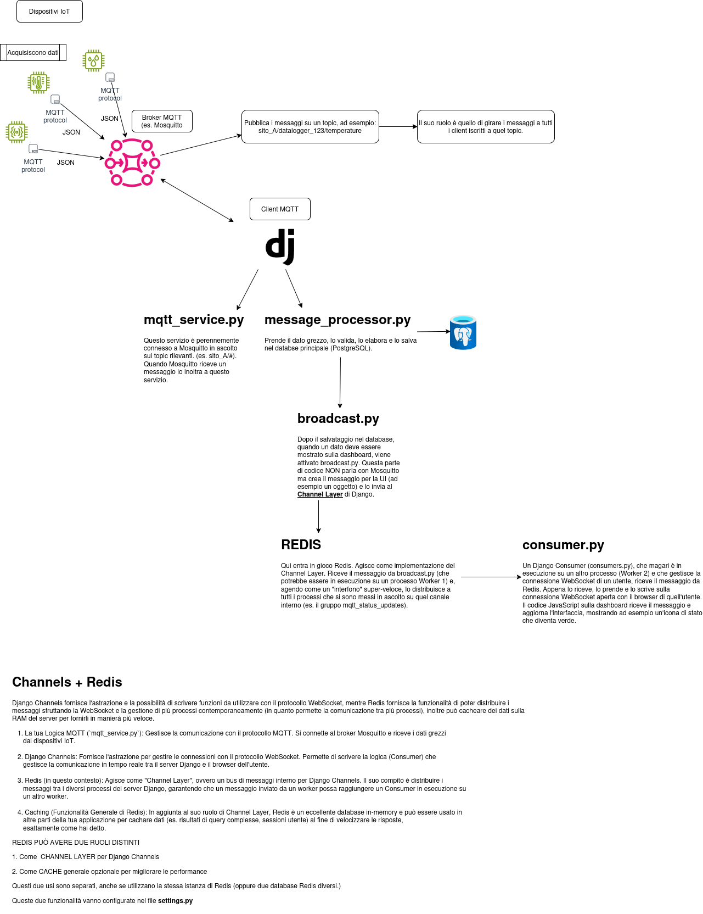

## Immagine (boilerplate)

<!-- 1) Markdown semplice -->
  

<!-- 2) Markdown con link -->

<!-- 3) Figura con didascalia (HTML per maggiore controllo) -->
<figure>
  
  <figcaption>Figura 1 — Architettura di Redis.</figcaption>
</figure>

<!-- Nota: usa percorsi relativi alla posizione del file o alla cartella assets del sito. -->